# greenwood-library-website

## 1. Newly Cretead Repository

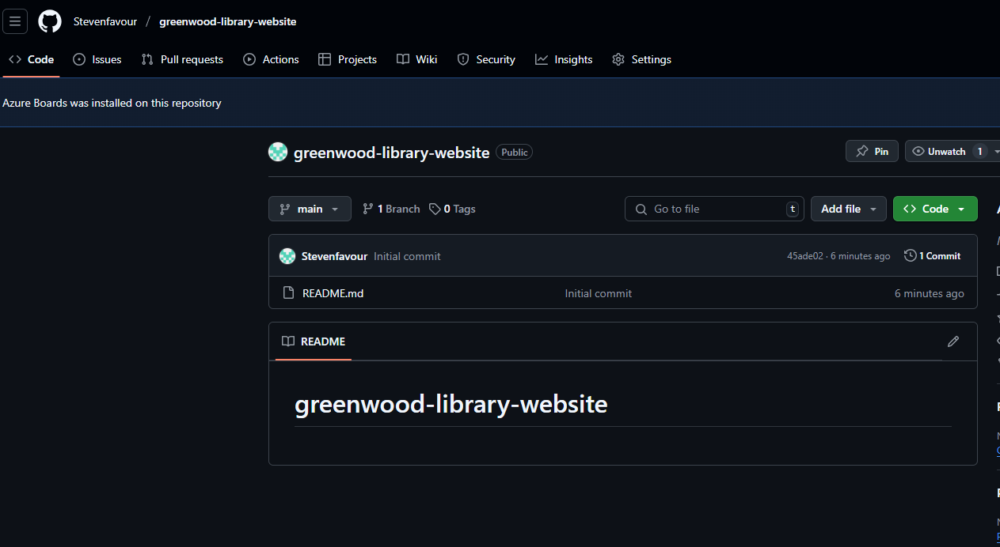

Img folder and Html files with random contents are shown in the image below.

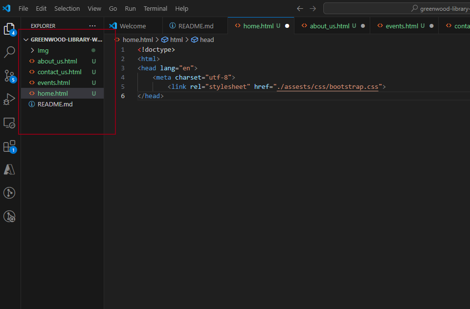

Changes to the afforementioned files and folders were committed into the main brain in the remote repository with git commands e.g git status, git add ., git commit -m "" and git push origin branchname. Image below demostrates these commands. 

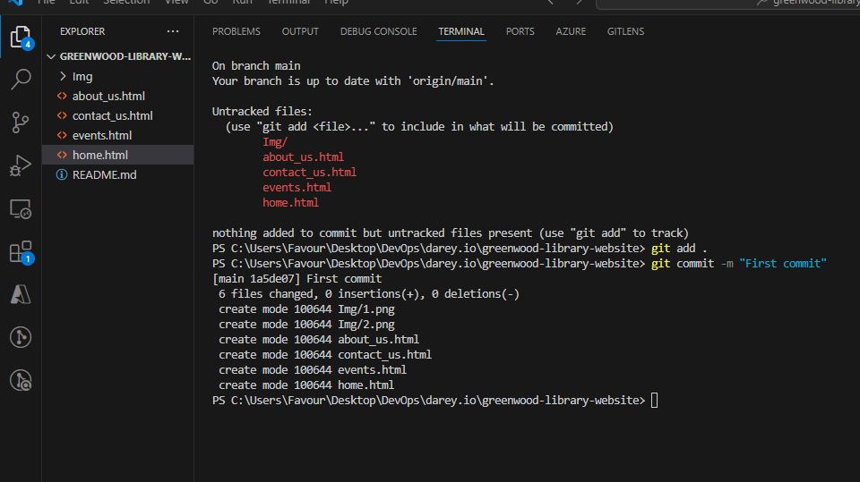

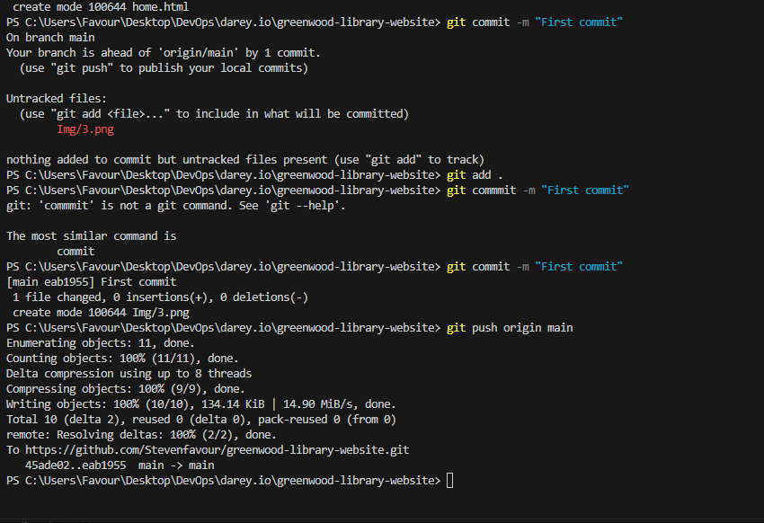

## 2. Morgan's Work (add-book-reviews branch)

The next image demonstrates the creation of add-book-reviews branch using the git checkout -b command.

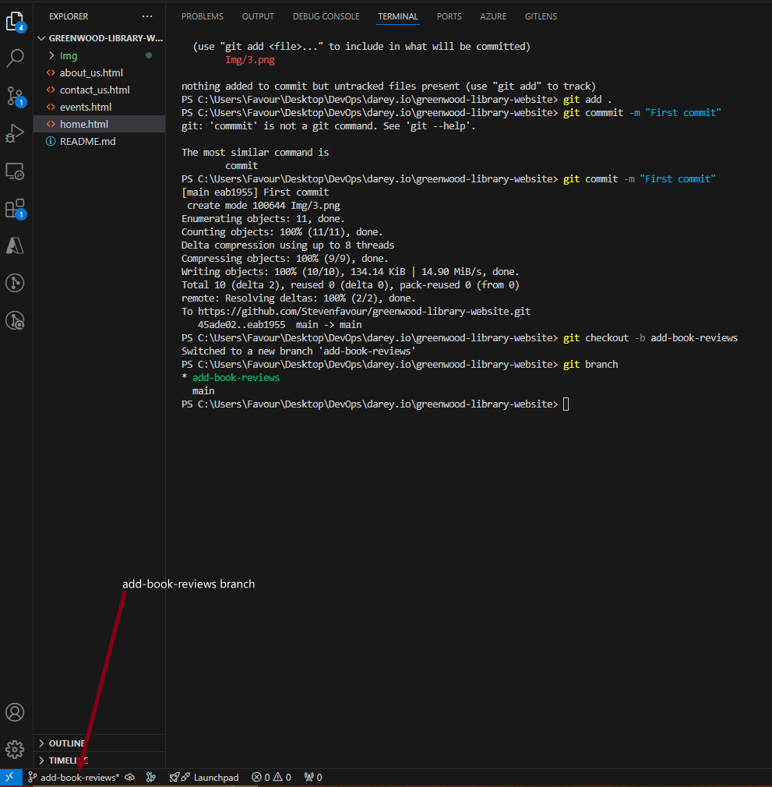

Changes were made to this new branch. A book-reviews.html file was created
On the left side of the image, under the file explorer section there we have the newly created book-reviews.html file. On the terminal pane, the git status command was used to view the untracked files which also includes the book-reviews.html file. git add., git commit and git push were used also to commit and push the changes to the add-book-reviews branch.  

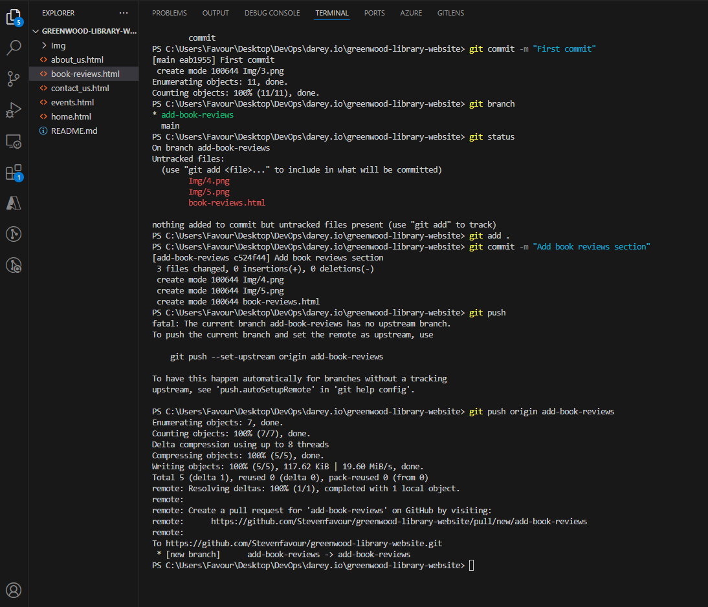

Back to GitHub, a pull request was created to merge the add-book-reviews branch with the main branch. The images below show the pull request created and the merge operation.

### Pull request

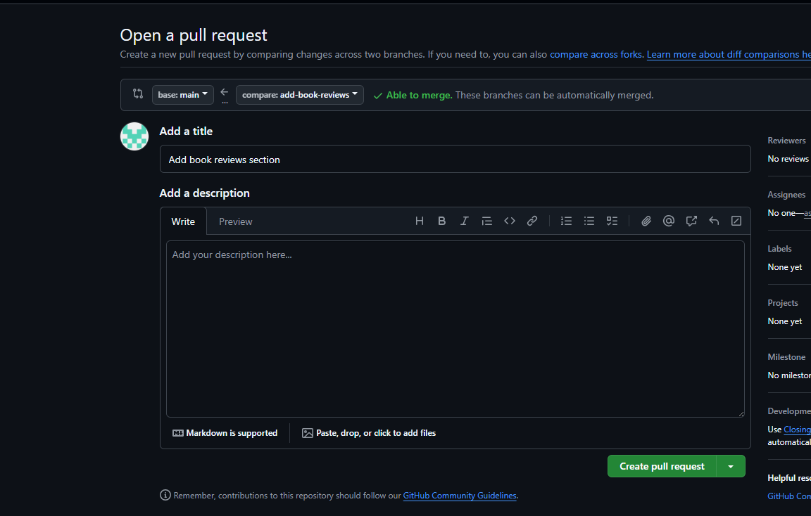

### Merge operation

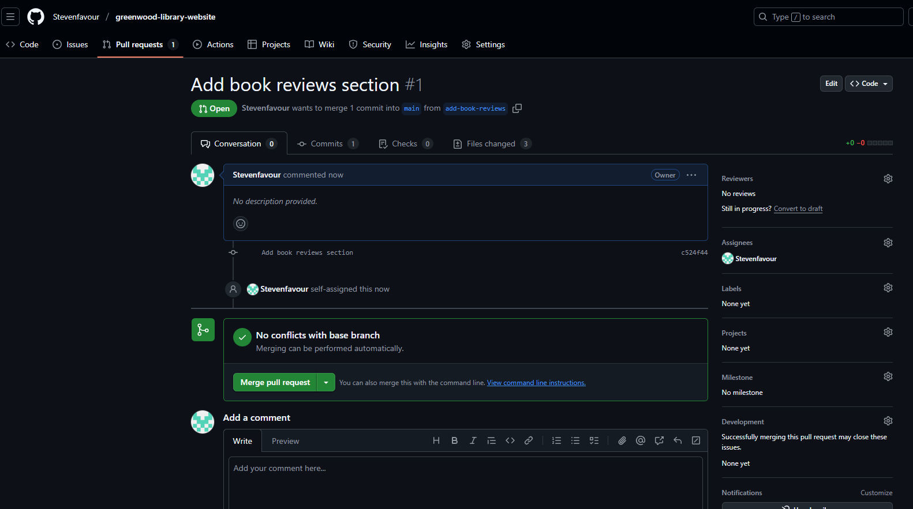

### Merge operation successful

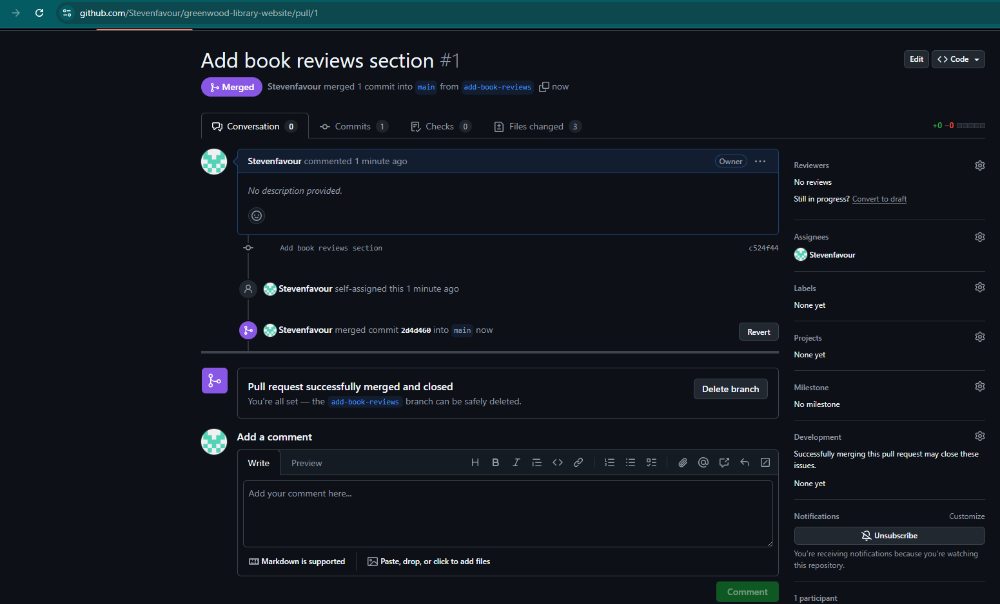

 ## 3. Jamie's Work(update-events branch)

 The next image demonstrates the creation of update-events branch using the git checkout -b command. The yellow arrow is pointing to the update-events branch on the lower part ofthe screen.

 Changes were made to this new branch. A events-update.html file was created
On the left side of the image, under the file explorer section, there we have the newly created events-update.html file. On the terminal pane, the git status command was used to view the untracked files which also includes the events-update.html file. git add., git commit and git push were used also to commit and push the changes to the update-events branch.

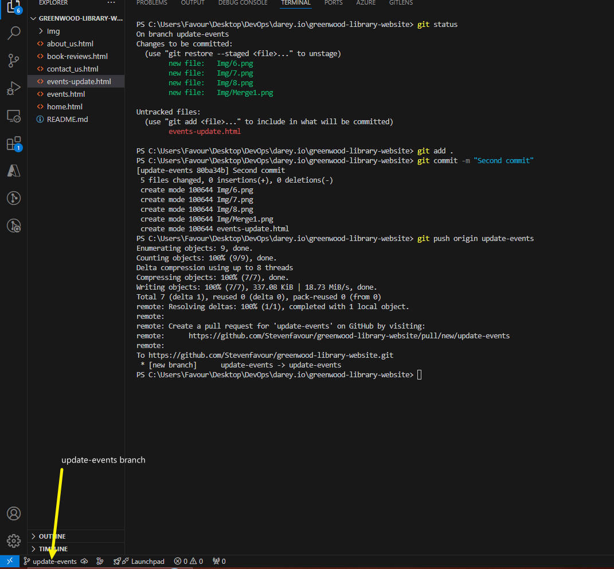

Back to GitHub, a pull request was created to merge the update-events branch with the main branch. The images below show the pull request created and the merge operation.

### Pull request

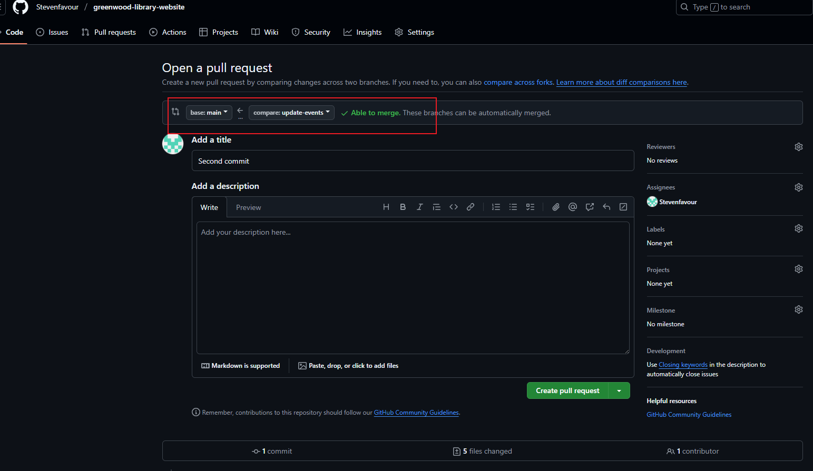

### Merge operation successful

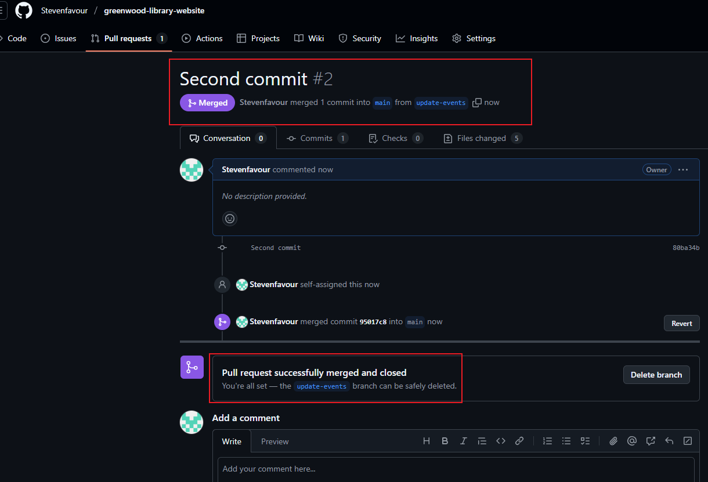
 

