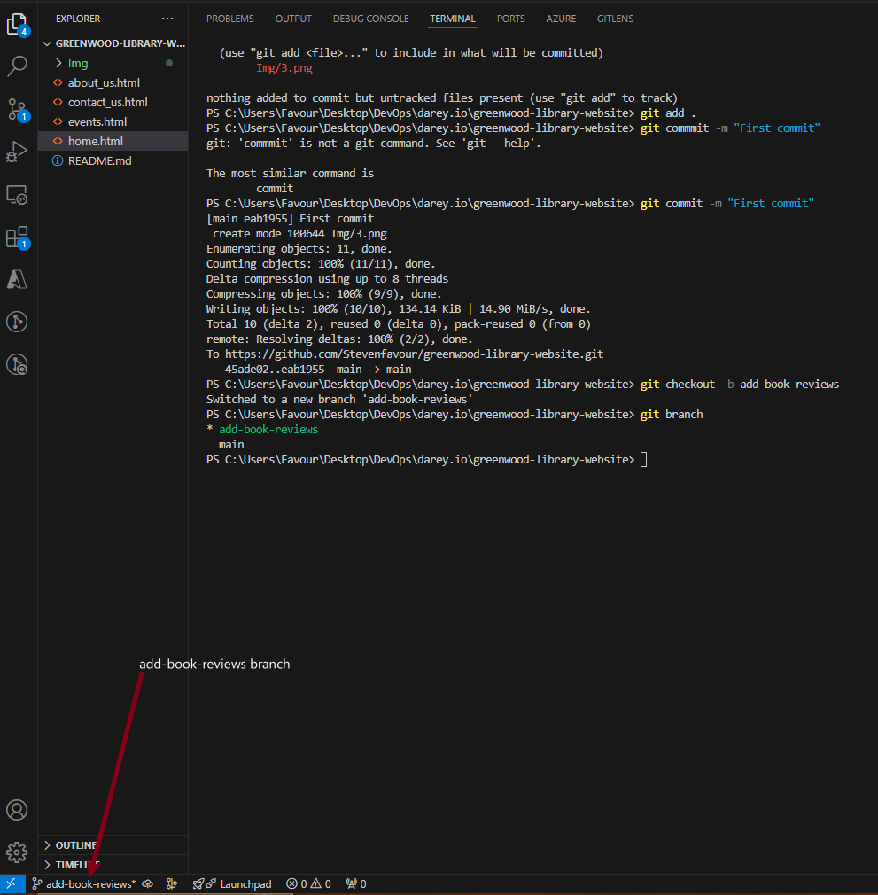
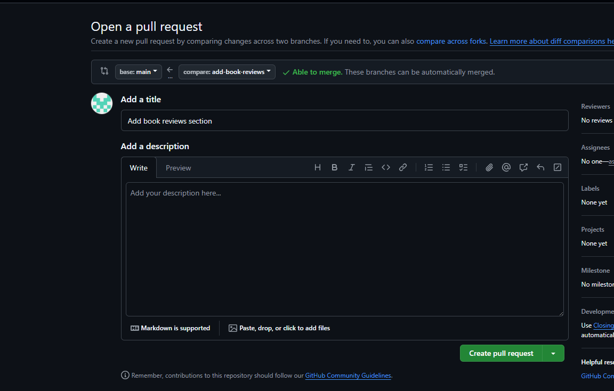
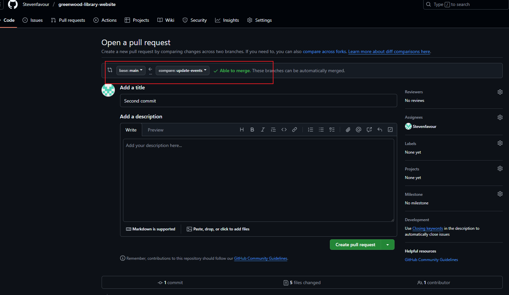
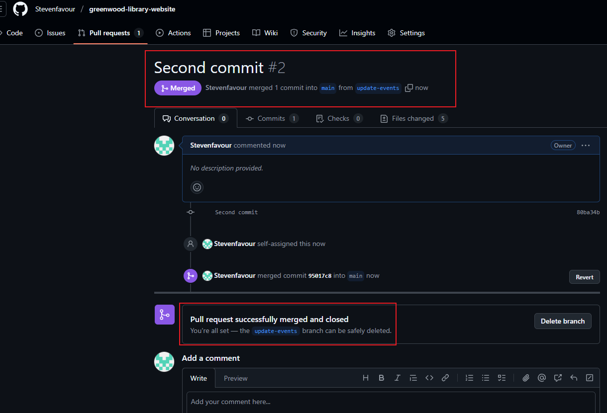

# Collaborative Web Story Project: *The Greenwood Tales*

Welcome to the Greenwood Tales — a collaborative web story crafted by multiple contributors using Git branching, pull requests, and merges. This project is a demonstration of real-world Git workflows, creative content building, and teamwork.

---

## 📖 About the Project

This project simulates the creation of a fictional multi-chapter web story using collaborative version control practices. Each contributor added a "chapter" or feature to the ongoing story using separate Git branches, mimicking how teams work together on shared creative content.

---

## 🧭 How to Navigate the Story

Each HTML file in this repository represents a different part or chapter of the story:

- `index.html`: The introduction and landing page.
- `book-reviews.html`: Chapter 1 — Added by Morgan.
- `events-update.html`: Chapter 2 — Added by Jamie.

You can open each file in your browser to explore different parts of the story. Navigate using the file names, or build a simple navigation bar linking them together for a better reading flow.

---

## 🔀 Git Workflow Overview

This project follows a realistic Git collaboration model. Here’s how each contributor participated:

---

### 🧑‍💻 1. Initial Setup (Main Branch)

The project was initialized with a basic file structure including:

- An `Img` folder for visuals.
- Initial HTML files to set the stage.
  
Basic Git operations used:  
```bash
git init  
git add .  
git commit -m "initial commit"  
git push origin main  
```


---

### ✍️ 2. Morgan's Contribution – *Chapter 1* (`add-book-reviews` Branch)

Morgan created a new branch using:
```bash
git checkout -b add-book-reviews
```
They added a new chapter via `book-reviews.html`. Changes were committed and pushed to the remote repository.



A pull request was created and successfully merged into the main branch:

  


---

### ✍️ 3. Jamie's Contribution – *Chapter 2* (`update-events` Branch)

Jamie created a new branch using:
```bash
git checkout -b update-events
```
They added `events-update.html` to expand the story world.


A pull request was raised and merged into the main branch:

  


---

## 🙏 Acknowledgments

Special thanks to:

- All contributors for their creative input.
- Our instructors for guiding this collaborative experience.
- Reviewers and readers for exploring our evolving story.

---

## 💡 Final Thoughts

This project showcases not just technical Git skills but also emphasizes creativity, collaboration, and structured storytelling using version control. We hope you enjoy both the process and the product!
